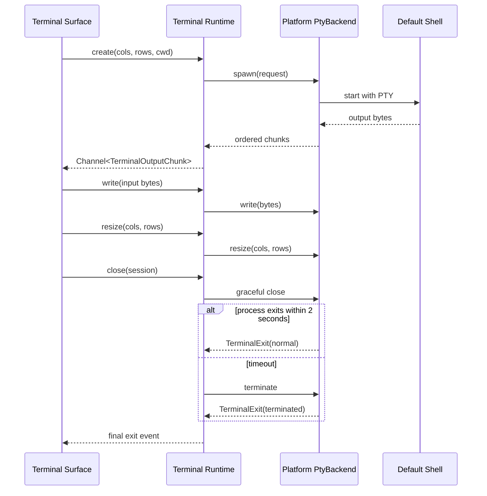

# 跨平台终端最小闭环

## 0. 术语约定

| 术语 | 定义 | 防冲突结论 |
|---|---|---|
| Terminal Session | 一个本地 Shell 进程及其 PTY 生命周期 | 沿用 roadmap 的 `TerminalSession`，不等同于后续 Agent Session |
| PtyBackend | macOS Unix PTY 与 Windows ConPTY 的统一行为接口 | 沿用 roadmap 契约，UI 不感知具体操作系统实现 |
| Terminal Surface | 浏览器侧承载 xterm.js 的单一终端视图 | 本 feature 只有一个 Surface，不引入 Pane、Tab 或 Workspace 布局 |
| Output Chunk | 从 PTY 按顺序送到 UI 的原始字节块 | 不按字符串或行切分，不等同于日志记录 |
| Default Shell | 无用户配置时用于最小闭环的系统 Shell | macOS 读取可执行的 `SHELL`，失败回退 `/bin/zsh`；Windows 使用系统 `powershell.exe` |

## 1. 决策与约束

### 需求摘要

为需要在 macOS 和 Windows 使用同一种 OTTY 工作流的开发者，建立第一个可运行产品闭环：打开应用后自动启动一个本地 Shell，能够输入命令、按顺序看到输出、调整终端尺寸并关闭会话。成功必须由两端真实运行证据共同证明，单平台成功不算完成。

### 明确不做

- 不实现标签、分屏、多窗口、设置页、主题选择和会话恢复。
- 不检测 zsh/bash/fish/PowerShell Core/WSL/Git Bash 等完整 Profile；本次只启动平台默认 Shell。
- 不实现搜索、链接识别、IME、复杂 Unicode、复制保护和滚动历史增强。
- 不接入任何 Agent、Prompt Queue、SSH、文件、Git、Recipe 或控制 CLI。
- 不做管理员/提权会话；请求提权必须返回 `UNSUPPORTED`。
- 不把只编译成功或 mock runtime 通过当作 Windows/macOS 运行验收。

### 复杂度档位

- 健壮性 = L3：PTY 创建、输入、缩放和退出都有明确错误语义。
- 结构 = layers：Shared UI、Terminal Runtime 和平台 backend 保持单向依赖。
- 性能 = budgeted：输出批次最大 64 KiB；本地输入到可见回显 p95 目标小于 50 ms；连续 1 MiB 输出不得丢字节或乱序。
- 可测试性 = verified：共享契约测试 + 两个平台真实运行 smoke 共同证明闭环。
- 安全性 = validated：命令参数不经 shell 字符串拼接；本 feature 禁止提权。
- 兼容性 = cross-version：macOS 14+ 与 Windows 10 22H2 / Windows 11 使用同一公共契约。
- 其余维度走对外发布桌面应用的默认档位。

### 关键决策

1. **一个共享前端、两个 PTY backend**：Terminal Surface 和状态模型只写一份；平台差异停在 `PtyBackend` 之后。
2. **Rust 是 Session 生命周期权威**：UI 只持有投影和终端实例，不自行判断进程是否存活。
3. **输出使用有序 Channel**：Rust 将原始字节按 sequence 推给前端；普通广播事件不承载高频终端数据。
4. **Resize 由可视尺寸驱动**：前端计算 cols/rows 后去抖发送；Rust 校验后同时更新 PTY 与 Session 快照。
5. **关闭有界且可观察**：先请求正常关闭，超过 2 秒仍未退出则终止；最终必须产生一次 Terminal Exit 事件。
6. **双平台 conformance suite**：相同的创建、写入、缩放、关闭和错误场景分别作用于 Mac/Windows backend。
7. **拒绝先做 Mac 再“以后移植”**：第一条 feature 同时覆盖两个 backend，避免公共接口被单平台行为锁死。

### 验收环境前置

- macOS 14+ 真实运行环境。
- Windows 10 22H2 或 Windows 11 真实运行环境；交叉编译不能替代运行验证。
- 两端都能启动无用户配置的系统默认 Shell。

## 2. 名词与编排

### 2.1 名词层

#### 现状

仓库没有应用代码、终端类型或进程模型。本 feature 从 roadmap 第 4.1、4.2 节的公共契约起步，不存在需要兼容的旧接口。

#### 变化

新增以下公共名词；字段名和错误码必须与 roadmap 保持一致：

```text
TerminalSessionId = EntityId

CreateTerminalRequest {
  platform: macos | windows,
  profile_id: "system-default",
  cwd: ResourceUri | null,
  command: null,
  env: map<string, string>,
  cols: u16,
  rows: u16,
  elevation: normal
}

TerminalSession {
  id: TerminalSessionId,
  platform: macos | windows,
  shell: string,
  cwd: ResourceUri,
  cols: u16,
  rows: u16,
  status: starting | running | exited | failed,
  exit_code: i32 | null
}

TerminalOutputChunk { session_id, sequence, bytes, eof }
TerminalExit { session_id, exit_code, reason: normal | terminated | spawn_failed | io_failed }
TerminalSurfaceState = idle | creating | running | exited | error(AppError)
```

`PtyBackend` 必须提供：`spawn`、`write`、`resize`、`signal`、`close`。`MacPtyBackend` 和 `WindowsPtyBackend` 只能返回公共 `TerminalSession`、`TerminalOutputChunk`、`TerminalExit`，不得把 native handle 暴露给 UI。

#### 接口示例

```text
输入：create({ platform: macos, profile_id: "system-default", cols: 120, rows: 36 })
输出：TerminalSession { status: running, shell: "/bin/zsh", cols: 120, rows: 36 }

输入：create({ platform: windows, profile_id: "system-default", cols: 120, rows: 36 })
输出：TerminalSession { status: running, shell: "powershell.exe", cols: 120, rows: 36 }

输入：write(exited_session, bytes)
输出：AppError { code: PROCESS_EXITED, retryable: false }

输入：resize(session, cols: 0, rows: 36)
输出：AppError { code: INVALID_ARGUMENT, retryable: false }
```

来源：`.codestable/roadmap/otty-desktop/otty-desktop-roadmap.md` 第 4.1、4.2 节。

### 2.2 编排层



#### 现状

无现有启动流程。应用没有前端入口、Rust Session 管理、PTY backend、命令注册或输出通道。

#### 变化

1. 应用启动后挂载唯一 Terminal Surface，并根据可视区域计算初始 cols/rows。
2. UI 请求创建系统默认 Shell；Terminal Runtime 校验参数并选择当前平台 backend。
3. backend 启动 Shell 后，Rust 保存 Session 权威状态并打开有序输出 Channel。
4. UI 将 Channel 字节写入 xterm.js，将 xterm 输入原样写回 Rust。
5. 视图尺寸变化后去抖发送新 cols/rows；无变化不重复调用 backend。
6. 用户关闭窗口或 Session 时执行有界清理，并向 UI 发出唯一 Terminal Exit。
7. 创建失败时应用仍保持打开，Terminal Surface 进入 error，展示错误并允许重试。

#### 流程级约束

- 同一 Session 的输出 sequence 必须严格递增；UI 收到重复或倒序 chunk 时记录错误并停止消费该流。
- 终端字节不写入日志；日志只记录 Session ID、状态、错误码、字节计数和耗时。
- 同一 Session 的 write/resize/close 按调用顺序处理；close 后的新操作返回 `PROCESS_EXITED`。
- Resize 去抖窗口建议 50 ms，最后一次尺寸必须送达 backend。
- Spawn 失败不产生 running 状态；成功创建的 Session 最终必须产生且只产生一次 exit。
- 窗口关闭、开发模式热重载和异常退出路径都必须清理子进程，不能留下孤儿 Shell。

### 2.3 挂载点清单

1. Tauri command 注册表：新增 terminal create/write/resize/close 命令。
2. Tauri capability 配置：仅允许主 WebView 调用上述 terminal 命令。
3. 应用根视图：挂载唯一 Terminal Surface，删除后用户不再看到终端能力。
4. PtyBackend 注册入口：按编译目标注册 Mac 或 Windows backend。
5. 应用退出钩子：调用 Terminal Runtime 的全部 Session 清理流程。

### 2.4 推进策略

1. **工程与编排骨架**：共享 UI 能调用空 Terminal Runtime，并走完 creating → running → exited 状态流。退出信号：双平台构建通过，stub 流程可观察。
2. **公共名词与 conformance harness**：固定 Session、事件、错误和 backend 契约。退出信号：同一契约测试可对任意 backend 执行。
3. **macOS PTY 节点**：接通系统默认 Unix Shell。退出信号：Mac 真实输入输出、缩放和关闭 smoke 通过。
4. **Windows PTY 节点**：接通系统 PowerShell。退出信号：Windows target 编译通过，ConPTY 路径包含与 macOS 相同的输入、缩放、关闭和 conformance 入口；真实 Windows smoke 在第 7 步统一补证。
5. **xterm.js 数据流与交互**：接通字节 Channel、输入和尺寸同步。退出信号：macOS 打包应用可见终端连续交互，Windows 共享前端与 target 编译通过；Windows 可见交互在第 7 步统一补证。
6. **生命周期与错误收口**：覆盖 spawn 失败、退出、重试和孤儿进程清理。退出信号：关键错误场景都有可观察结果。
7. **双平台验收与性能证据**：运行完整 smoke、1 MiB 输出和输入回显测量。退出信号：第 3 节每个场景都有两端证据或明确的平台专属证据。

### 2.5 结构健康度与微重构

#### 评估

- 文件级：仓库没有应用源码，不存在需要修改的胖文件、职责混杂或高密度改动点。
- 目录级：仓库没有前端、Rust 或测试目录，不存在同层文件摊平；新目录按 Shared UI、Terminal Runtime、平台 backend 和测试职责建立。
- Compound convention：`.codestable/compound/` 当前没有目录组织或命名约定。

#### 结论：不做微重构

本 feature 从空仓库建立第一套结构，没有可搬迁的现有行为。实现阶段应直接按 roadmap 模块边界落新代码，不为未来功能预建空模块。

## 3. 验收契约

### 关键场景清单

1. macOS 启动应用 → 自动进入可交互默认 Unix Shell，执行 `printf __OTTY_OK__` 后原样显示标记。
2. Windows 启动应用 → 自动进入可交互 `powershell.exe`，执行 `Write-Output __OTTY_OK__` 后原样显示标记。
3. 在任一平台连续输入普通 ASCII 命令 → Shell 收到的字节与输入顺序一致，界面不重复字符。
4. 改变窗口尺寸 → xterm cols/rows 与 PTY 最终尺寸一致，中间重复尺寸不会产生额外 backend 更新。
5. 产生连续 1 MiB 有序输出 → UI 最终字节总量和顺序与源输出一致，应用保持可响应。
6. Shell 主动退出 → Surface 显示 exited 和退出码，后续 write 返回 `PROCESS_EXITED`。
7. 指定不存在的测试 Shell → Surface 显示 `NOT_FOUND` 或 `IO_ERROR`，应用不崩溃且可以重试。
8. 关闭窗口 → 2 秒内正常退出或被终止，系统中不存在该测试 Shell 的孤儿进程。
9. macOS backend 与 Windows backend 分别运行同一 conformance suite → 创建、写入、缩放、关闭和错误语义一致。
10. macOS 与 Windows 真实运行 smoke 均通过 → feature 才能验收；任一平台仅构建或 mock 通过时保持未完成。

### 明确不做的反向核对项

- UI 中不应出现标签、分屏、设置、Agent、SSH、文件或 Git 入口。
- 代码中不应包含模型 API、Agent hooks、远程网络连接或凭证存储调用。
- 不应注册提权命令或在 Shell 启动参数中加入 sudo/UAC 绕过逻辑。
- 不应存在根据操作系统分叉的 Terminal Surface 业务组件；平台分支只能位于 backend/Platform Services 边界。
- 验收记录不得用交叉编译结果替代另一平台运行证据。

## 4. 与项目级架构文档的关系

验收通过后需要新增终端运行时架构文档，并更新 `ARCHITECTURE.md`：

- 记录 `TerminalSession`、`PtyBackend`、输出 Channel 和 Terminal Exit 的系统级名词。
- 记录 Shared UI → Terminal Runtime → platform backend → Shell 的主流程。
- 记录双平台 conformance、输出顺序、禁止记录终端字节、唯一 exit 和有界清理约束。
- 记录平台 backend 是未来 Shell Profile、Workspace Pane 和 Agent Session 的稳定扩展点。

当前 architecture 只有骨架，因此本 feature 不修改已有架构事实；上述内容只在实现验收后按实际代码回写。
