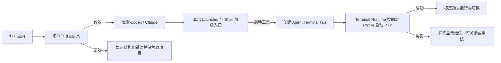

# 项目级 Agent 工作区垂直切片

## 0. 术语约定

| 术语 | 定义 | 防冲突结论 |
|---|---|---|
| Project Workspace | 当前工作台绑定的一个本地项目根目录 | 是早期项目上下文，不等同于 roadmap 中含窗口/分屏/恢复的完整 Workspace Snapshot |
| Agent Launcher | 检测并启动已安装 Codex 或 Claude Code 的固定入口 | 只表达可用性与进程启动，不等同于后续 Agent Adapter/hooks |
| Launch Profile | Terminal Runtime 可启动的固定目标：Shell、Codex、Claude | 扩展现有 `profile_id`，不开放任意命令执行 IPC |
| Agent Terminal Tab | 绑定 Project Workspace 和 Terminal Session 的平面标签 | 只表示进程状态，不提供递归 Pane 或 Agent 生命周期语义 |
| Recent Project | 浏览器侧记住的最近打开项目摘要 | 只用于快速重开，不等同于 SQLite Session Persistence |

## 1. 决策与约束

### 需求摘要

把当前单终端升级为项目级 AI 编程工作台：用户可以打开本地项目、看到 Codex 与 Claude Code 的真实可用性，并在该项目目录启动多个可切换的 Agent 或 Shell 标签。工具缺失或启动失败时必须给出明确原因，普通 Shell 始终可用作降级路径。

### 明确不做

- 不安装或修改 Codex/Claude 配置与 hooks，不提供 `awaiting_input` 等生命周期状态。
- 不恢复 Agent 会话，不引入 SQLite、云同步或跨设备项目同步。
- 不实现 Prompt Composer、Prompt Queue、文件浏览、Git、SSH、Recipe 或控制 CLI。
- 不实现递归分屏、多窗口和跨项目同时运行；本切片一次只激活一个 Project Workspace。
- 不接受前端传入任意 executable、参数或 shell 字符串，不把 Launcher 变成通用命令执行 API。

### 复杂度档位

- 健壮性 = L3：项目路径、固定 profile 和进程错误均有结构化语义。
- 结构 = layers：Shared UI → Project/Agent API → Terminal Runtime，平台探测停在 Rust 边界。
- 可测试性 = tested：纯状态逻辑、IPC 契约、项目校验和启动 profile 有定向测试。
- 安全性 = validated：仅允许固定 AgentKind，项目路径规范化，不拼接用户输入到 shell。
- 兼容性 = cross-version：macOS 14+ 与 Windows 10 22H2/11 使用同一公共契约。
- 其余维度走对外发布桌面应用默认档位。

### 关键决策

1. **项目先于终端**：应用根状态由 Project Workspace 驱动，Terminal Session 必须带该项目的 cwd。
2. **固定 Launcher，不开放任意命令**：`profile_id` 只增加 `agent:codex` 与 `agent:claude`，后端自行解析 executable。
3. **检测与启动分离**：UI 先展示 `AgentAvailability`，但启动时后端重新解析，避免缓存路径失效。
4. **平面多标签作为早期模型**：本切片允许多个并发 Session；后续 `workspace-tabs-panes` 在此基础上扩展递归布局。
5. **单活动项目**：打开另一个项目会卸载当前标签并为新项目建立 Shell 标签，避免跨项目状态在未有持久化模型前混杂。
6. **工业控制台视觉方向**：以石墨色工作面、信号绿状态和琥珀色 Agent 强调建立高密度但可扫描的工程工作台。

## 2. 名词与编排

### 2.1 名词层

#### 现状

- `src/terminal/contracts.ts` 的 `CreateTerminalRequest.profileId` 只允许 `system-default`。
- `src-tauri/src/terminal/contracts.rs` 明确拒绝其他 profile 与任何 `command`。
- `src/App.tsx` 只挂载一个 `TerminalViewport`，没有项目、Agent 可用性或标签实体。
- `src/terminal/useTerminalSession.ts` 只对单个自动创建的默认 Shell 管理 UI 投影。

#### 变化

新增并共享以下名词：

```text
ProjectWorkspace { id, name, rootPath, rootUri }
AgentKind = codex | claude
AgentAvailability { kind, available, executable, version, reason }
LaunchProfileId = system-default | agent:codex | agent:claude
AgentTerminalTab { id, projectId, kind: shell | AgentKind, title,
  phase: idle | creating | running | exited | error }
```

接口示例：

```text
project_open({ path: "/work/acme" })
→ ProjectWorkspace { name: "acme", rootUri: "file:///work/acme" }

agent_detect()
→ [{ kind: codex, available: true, executable: "/.../codex", version: "codex-cli 0.147.0" },
   { kind: claude, available: false, executable: null, version: null, reason: "未找到 Claude Code" }]

terminal_create({ profileId: "agent:codex", cwd: "file:///work/acme", ... })
→ TerminalSession { shell: "codex", cwd: "file:///work/acme", status: running }

project_open({ path: "/missing" })
→ AppError { code: NOT_FOUND, retryable: false }
```

来源：roadmap `belfry-desktop` 第 4.1、4.9 节与现有 Terminal Runtime 契约。

### 2.2 编排层



#### 现状

当前为线性单 Session 流程：应用挂载 → 默认请求 → PTY → xterm；创建参数、错误和 Session 投影都只服务唯一终端。

#### 变化

1. 应用优先重开最近项目；首次运行使用当前目录，若打包态 cwd 是文件系统根则回退用户主目录，并加载 Recent Projects。
2. Rust 规范化项目路径；成功后 UI 并行请求 AgentAvailability。
3. UI 根据 availability 启用 Codex/Claude Launcher，Shell 始终启用。
4. 点击 Launcher 创建独立 Agent Terminal Tab；每个标签拥有自己的 Channel、xterm 与 Terminal Session。
5. 切换标签只改变可见性，不卸载后台 Session；关闭标签才释放对应 PTY。
6. 打开另一个项目时卸载旧项目全部 Session，更新 Recent Projects，再创建新项目 Shell 标签。

#### 流程级约束

- `ProjectService.open` 失败时不得替换当前项目，也不得关闭现有 Session。
- Agent 探测失败只影响对应 Launcher；Shell 降级路径保持可用。
- AgentKind 到 executable 的映射由 Rust 固定注册，前端不得提供命令或参数。
- GUI PATH 与交互 Shell PATH 不一致时，可使用平台等价用户环境探测；探测命令内容必须来自固定 AgentKind。
- 每个标签独占 sequence、Channel 和关闭生命周期；切换标签不得重建进程。
- Recent Projects 最多保留 6 条，不保存 Prompt、终端输出或环境变量。
- UI 展示结构化 `AppError.code` 与 message；未知错误保留通用失败语义。

### 2.3 挂载点清单

1. 应用根视图：Project Workspace shell — 用项目工作台替换单 Terminal Surface。
2. Tauri command 注册表：`project_open`、`agent_detect` — 新增项目与 Launcher IPC。
3. Terminal Launch Profile 注册表：`agent:codex`、`agent:claude` — 新增固定 PTY 启动目标。
4. 浏览器持久化 key：`belfry.recent-projects.v1` — 新增 Recent Projects 摘要。

### 2.4 推进策略

1. 结构微重构：拆出终端控制器和 native launch 解析，保持现有单 Shell 行为不变。退出信号：现有测试与构建通过，对外契约不变。
2. 项目与 Launcher 名词骨架：建立共享类型、ProjectService 与 Tauri commands。退出信号：当前目录可规范化，错误码可观察。
3. Agent 探测与固定启动节点：实现 Codex/Claude 可用性和 Launch Profile。退出信号：已安装工具可报告版本并从项目 cwd 启动，缺失工具返回 NOT_FOUND。
4. 工作台静态结构与状态编排：建立项目栏、Launcher、标签栏和工作面。退出信号：使用占位状态可完整操作单项目平面标签。
5. 多 Session 联调与持久化：接入真实 Terminal Session、Recent Projects 和结构化错误。退出信号：多个会话独立运行，切换不重建，切项目有界清理。
6. 验证与视觉收尾：覆盖关键场景、可访问性与桌面端视觉检查。退出信号：测试、构建和真实桌面 smoke 有证据。

### 2.5 结构健康度与微重构

#### 评估

- 文件级 — `src-tauri/src/terminal/native.rs`：270 行且同时包含 PTY 生命周期、cwd/URI、Shell 解析和命令构建；追加 Agent profile 会超过项目 300 行硬门禁并新增职责。
- 文件级 — `src/terminal/useTerminalSession.ts`：218 行且同时包含 React 状态、xterm 创建、IPC、事件顺序和 ResizeObserver；多标签参数化会继续提升职责密度。
- 目录级 — `src/terminal/` 当前 6 个同层文件，本次拆出一个控制器仍未达到摊平阈值。
- 目录级 — `src-tauri/src/terminal/` 当前 8 个同层文件，但文件以 backend/contracts/native/runtime 职责命名明确；新增 launch 子模块比继续膨胀 native.rs 更符合边界。
- Compound convention 检索无命中。

#### 结论：微重构（拆文件）

- 搬什么：把浏览器侧 xterm 挂载/事件/resize 控制从 hook 搬出；把 Rust cwd、URI、默认 Shell 与 CommandBuilder 解析从 native backend 搬出。
- 搬到哪：`src/terminal/terminalController.ts` 与 `src-tauri/src/terminal/launch.rs`。
- 行为不变怎么验证：现有前端/Rust 测试与构建通过；`useTerminalSession` 对外返回值、默认 profile 与 backend trait 签名不变。
- 步骤序列：先纯移动并修正 import/module，再运行基线验证，之后才加入 Project/Agent 行为。

## 3. 验收契约

### 关键场景清单

1. 打开应用 → 优先恢复最近项目；首次运行使用当前目录或用户主目录，并自动出现一个可交互 Shell 标签。
2. 输入存在的本地目录 → 工作台显示规范化名称/路径，Shell 的 cwd 是该目录。
3. 输入不存在或非目录路径 → 显示 `NOT_FOUND`/`INVALID_ARGUMENT`，旧项目和旧会话保持不变。
4. 本机已安装 Codex/Claude → Launcher 显示版本并可点击；启动后终端进程运行在当前项目目录。
5. 某 Agent 未安装 → 对应 Launcher 禁用并显示原因，Shell 和另一 Agent 不受影响。
6. GUI PATH 未直接包含已安装 Agent、但用户命令环境可找到 → 检测器仍报告可用。
7. 连续启动两个 Agent/Shell → 生成两个独立标签；切换标签不导致任一进程退出或重建。
8. 关闭一个标签 → 只关闭对应 Terminal Session，其余标签继续运行。
9. 打开另一个项目 → 旧标签有界清理，新项目成为活动项目并创建 Shell 标签。
10. Agent 在检测后被移除或启动失败 → 对应标签显示结构化错误，可关闭或重试，应用不崩溃。
11. 重开应用 → 最近项目列表最多恢复 6 条，不恢复终端输出、Prompt 或 Agent 进程。
12. 键盘可聚焦项目表单、Launcher、标签和关闭按钮；状态不只依赖颜色表达。

### 明确不做的反向核对项

- 代码中不应修改 `~/.codex`、Claude 配置或安装 hooks。
- 不应出现 SQLite、云同步、Prompt Queue、Git、SSH、Recipe 或文件编辑能力。
- 不应出现递归 LayoutNode、分屏控制或跨项目并发模型。
- IPC 不应接受任意 executable、参数数组或拼接用户输入的 shell 命令。
- UI 不应展示 `awaiting_input`、`completed` 等只有 hooks 才能证明的 Agent 状态。

## 4. 与项目级架构文档的关系

验收后需要把 Project Workspace、固定 Agent Launcher、Launch Profile 和平面标签的现状回写到 architecture，并记录 Shared UI → Project/Agent commands → Terminal Runtime → PTY 的主流程。长期约束包括固定 AgentKind 信任边界、探测失败不阻塞 Shell、标签独占 Session、Recent Projects 不保存敏感内容。后续完整 Workspace 与 Agent Adapter 应明确从这些早期名词演进，而不是建立平行模型。
