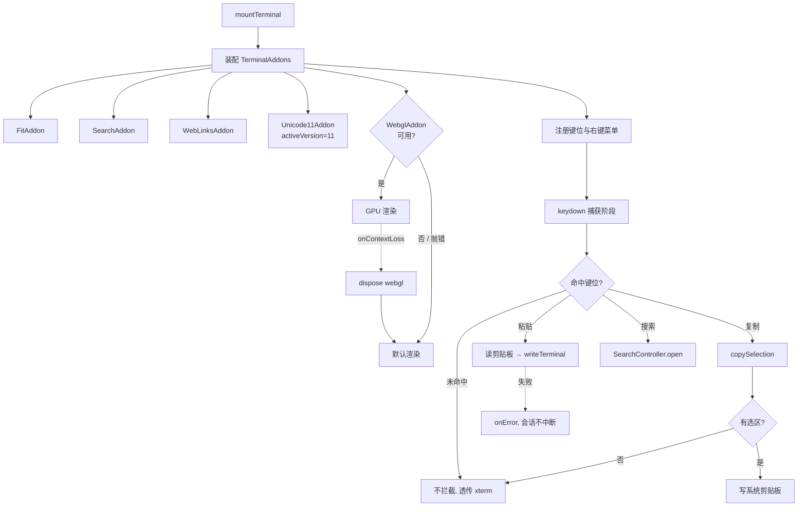

# 终端交互兼容性

## 0. 术语约定

| 术语 | 定义 | 防冲突结论 |
|---|---|---|
| **终端搜索**（Terminal Search） | 在当前会话回滚缓冲区内按关键字定位并高亮 | `rg "search"` 全仓仅命中 `src-tauri/src/agent/detection.rs:49` 的 `search_path`（PATH 探测），属 Rust 侧不同域，无冲突 |
| **剪贴板桥**（Clipboard Bridge） | 前端与系统剪贴板之间的读写通道，屏蔽 webview 差异 | `rg "clipboard\|Clipboard"` 全仓零命中，全新术语 |
| **终端右键菜单**（Terminal Context Menu） | 终端画布上的自定义右键浮层 | `rg "contextmenu\|ContextMenu"` 全仓零命中，全新术语 |
| **链接侦测**（Link Detection） | 输出流中 URL 的识别与点击打开 | `rg "link"` 仅命中 `BlinkMacSystemFont` / `cursorBlink` 子串，非同名概念，无冲突 |

沿用既有术语不再重复定义：`TerminalHandle`、`TerminalLaunch`、`TerminalSession`、`TerminalPhase`（`src/terminal/contracts.ts`）。

## 1. 决策与约束

### 需求摘要

**做什么**：给终端补上四个 xterm addon（搜索 / 链接 / 宽字符 / GPU 渲染）与一套剪贴板交互（快捷键 + 右键菜单）。

**为谁**：requirement `cross-platform-ai-terminal` 的边界写明「BELFRY 托管用户已经安装的 CLI Agent」，且 roadmap 第 18 行要求「Agent 集成不可用时，产品必须完整退化为普通终端」。当前这条退化路径不成立——不能搜索、不能点链接、复制粘贴无保障、CJK 易错位。

**成功标准**（可验证形式见第 3 节）：

1. 会话内按快捷键可搜索回滚内容并逐条跳转、命中高亮
2. 输出中的 `http(s)://` URL 可点击并由系统默认浏览器打开
3. CJK 与 emoji 按 Unicode 11 宽度排版，不与后续字符重叠
4. GPU 渲染启用；上下文丢失时自动回退到默认渲染且会话不中断
5. 复制粘贴在 macOS 与 Windows 各自惯例键位下可用，且不劫持中断信号

**明确不做**：

- 不扩展 shell profile（bash / fish / pwsh / CMD / WSL / Git Bash 属 `shell-profiles-cross-platform`）
- 不改 `launch.rs` 的启动参数；shell 以 login 模式启动归 `shell-profiles-cross-platform`
- 不修「切换会话不自动聚焦终端」，已另记为 issue
- 不引入设置页 / 配置文件；字体、字号、scrollback 保持硬编码（属 `settings-config-themes`）
- 不做 OSC 7 / OSC 133 shell integration
- 不做 `addon-serialize` 与滚屏持久化
- 不做 TERM / COLORTERM 注入——**已在工作区 `launch.rs:70-73` 完成**，本 feature 不重复

### 复杂度档位

走桌面应用默认档位，无偏离。

### 关键决策

**D1. 剪贴板走 Tauri plugin，不用 `navigator.clipboard`**
终端粘贴由快捷键触发，不带用户手势；`navigator.clipboard.readText()` 在 WKWebView / WebView2 的无手势路径上会被拒或弹权限提示。换成 `navigator.clipboard` 名词层就少一个 Rust capability 条目，但错误语义变成「静默失败」，不可接受。

**D2. GPU 渲染必须带回退，不做「启用即假定可用」**
`WebglAddon` 的 `onContextLoss` 是常规事件（GPU 驱动重置、系统休眠均会触发），不接管就是黑屏。回退路径写进编排层而非「以后再说」。

**D3. 复制粘贴键位按平台分叉，但分叉点收敛在一处键位表**
macOS：`⌘C` / `⌘V`。Windows：`Ctrl+Shift+C` / `Ctrl+Shift+V`——`Ctrl+C` 必须留给 SIGINT。roadmap 第 4.3 节要求「Shared UI 不按操作系统名称分支，只按 capabilities 分支」，故键位表按 `Primary` / 修饰键组合声明（对齐 roadmap 4.4 的 `KeyChord`），不在组件里写 `if (isMac)`。

**D4. 搜索框内嵌在每个 `TerminalViewport` 内，不做全局单例**
所有会话常驻挂载、靠 `visibility` 切换（`src/App.tsx:81-88`）。`SearchAddon` 实例天然绑定 `Terminal` 实例，内嵌即无需 active-terminal 注册表——名词层少一个概念，也少一个「会话销毁时忘记摘除」的泄漏面。代价是 N 个会话有 N 个隐藏浮层 DOM，随 `visibility` 一起隐藏、不参与布局，可接受。被拒方案：全局单例 + 注册表，省 DOM 但要新增注册表名词并承担摘除责任。

**D5. Windows 下 `Ctrl+C` 始终透传为中断，复制只认 `Ctrl+Shift+C`**
被拒方案是 Windows Terminal 的「有选区时复制、无选区时中断」——它让同一按键有两种语义、行为依赖选区状态，残留选区时按 `Ctrl+C` 会意外变成复制而不是中断。终端里误吞中断信号的代价远高于多按一个修饰键。

### 前置依赖

roadmap 前置条目 `cross-platform-terminal-vertical-slice` 仍为 `in-progress`，已于 2026-08-10 记录依赖例外（见 roadmap 主文档第 7 节）：例外**只覆盖 design 与 implement，不覆盖验收**。本 feature 的 Windows 相关验收项同样需要真机证据。

## 2. 名词与编排

### 2.1 名词层

#### 现状

| 名词 | 位置 | 职责 |
|---|---|---|
| `TerminalHandle` | `src/terminal/terminalController.ts:23-27` | 挂载后的对外把手，仅 `applyTheme` + `dispose` |
| `mountTerminal` | `terminalController.ts:29` | 建 xterm、装 `FitAddon`、开 Channel、接输入、起会话 |
| `createXterm` | `terminalController.ts:167-179` | xterm 构造参数（字体 / 光标 / scrollback 硬编码） |
| `MountCallbacks` | `terminalController.ts:17-21` | 向 React 回吐 phase / error / session |
| `xtermTheme` | `src/theme/xtermTheme.ts:58-60` | 按亮暗返回 `ITheme`，含 `selectionBackground` |

当前 `terminal.loadAddon` 全仓只有一处（`terminalController.ts:36`），装的只有 `FitAddon`。

#### 变化

- **新增 `TerminalAddons`**（装配结果聚合）— 动机：addon 数量从 1 变 5，装配、dispose、失败回退都需要统一持有
- **新增 `SearchController`** — 动机：搜索是有状态交互（关键字、当前命中序号、选项），不能只暴露裸 `SearchAddon`
- **新增 `ClipboardBridge`** — 动机：D1，隔离 Tauri plugin 调用与错误语义
- **新增 `TerminalKeymap`** — 动机：D3，平台键位差异的唯一声明处
- **扩展 `TerminalHandle`** — 新增 `search` / `copySelection` / `paste` / `hasSelection`
- **扩展 `xtermTheme`** — 新增搜索高亮两色（当前命中 / 其余命中），因为 `ITheme` 现有键里没有它们

接口示例：

```ts
// 来源：src/terminal/terminalController.ts TerminalHandle（扩展）
export interface TerminalHandle {
  applyTheme: (theme: ITheme) => void;
  search: SearchController;
  copySelection: () => Promise<boolean>;   // 无选区 → false，不抛
  paste: () => Promise<void>;              // 读剪贴板失败 → 抛 AppError 语义的错误
  hasSelection: () => boolean;
  dispose: () => void;
}

// 来源：src/terminal/search.ts（新增）
export interface SearchController {
  open: (seed?: string) => void;
  close: () => void;
  find: (keyword: string, direction: "next" | "prev") => void;
  // 命中总数与当前序号供 UI 显示 "3/17"；无命中时 total=0
  subscribe: (listener: (state: SearchState) => void) => () => void;
}
export interface SearchState {
  open: boolean;
  keyword: string;
  current: number;  // 1-based；无命中为 0
  total: number;
}

// 来源：src/terminal/clipboard.ts（新增）
// 写入成功 → resolve；无选区 → resolve(false)，调用方据此决定是否透传按键
export function copySelection(terminal: Terminal): Promise<boolean>;
export function readClipboard(): Promise<string>;
```

### 2.2 编排层

#### 主流程



#### 现状

`mountTerminal`（`terminalController.ts:29-98`）是线性装配流：建 xterm → 装 `FitAddon` → `open(host)` → `fit()` → 建 Channel → 接 `onData` → 建 `ResizeObserver` → `startSession`。返回 `TerminalHandle`。拓扑是**线性 pipeline**，无分支。

输入唯一入口是 `terminal.onData`（`terminalController.ts:64-71`），经 `writeQueue` 串行化后交给 `writeTerminal`——这条串行链是既有的顺序保证，粘贴必须复用它而不是另开写入路径。

全局快捷键现状：`src/App.tsx:26-38` 在 window 捕获阶段拦截 `⌘B` / `⌘U`，注释写明「走捕获阶段，避免按键先被 xterm 吞进 shell」。

#### 变化

1. **装配段升级为带回退的分支**：`FitAddon` 之后追加 4 个 addon；其中 `WebglAddon` 用 try/catch 包裹并订阅 `onContextLoss`，失败即 dispose 回落默认渲染
2. **新增键位分支**：在 `mountTerminal` 内对宿主元素注册 keydown（捕获阶段），命中键位表则拦截，否则放行给 xterm
3. **新增右键分支**：宿主元素 `contextmenu` 事件 → 阻止默认 → 弹自定义浮层（复制 / 粘贴 / 全选 / 搜索）
4. **粘贴汇入既有写入链**：不新建写入路径，复用 `writeQueue`
5. **`⌘F` 接入 App.tsx 既有捕获模式**：扩展现有 keydown 表，不另起监听器

#### 流程级约束

- **错误语义**：剪贴板读写失败经 `MountCallbacks.onError` 上报，**不改变 `TerminalPhase`**——会话仍是 `running`，与既有 `write` 失败处理（`terminalController.ts:70`）一致
- **不劫持中断**：键位表未命中的组合一律不 `preventDefault`，确保 `Ctrl+C` 透传为 SIGINT
- **顺序**：粘贴内容经 `writeQueue` 串行，与键盘输入共用同一队列，不得并发写入
- **幂等**：`dispose` 需摘除新增的 keydown / contextmenu 监听与全部 addon；重复调用不抛
- **渲染回退单向**：一旦回落默认渲染，本次会话不再重试 GPU，避免抖动
- **可观测点**：GPU 回退需留一条可见痕迹（不写终端字节流，避免污染输出）

### 2.3 挂载点清单

| 挂载位置 | 具体文件 / key | 动作 |
|---|---|---|
| Tauri 权限清单 | `src-tauri/capabilities/default.json` → `permissions` 增加 clipboard-manager 读写项 | 修改 |
| Rust 插件注册 | `src-tauri/src/lib.rs:16` `tauri::Builder` 链上注册 clipboard 插件 | 修改 |
| 前端依赖 | `package.json` 新增 4 个 `@xterm/addon-*` 与 clipboard plugin JS 包 | 修改 |
| 全局快捷键表 | `src/App.tsx:26-38` keydown 表新增搜索键位 | 修改 |

四条。删掉任一条，对应能力在用户视角即消失（无权限则粘贴失败、无插件注册则调用报错、无依赖则 addon 不存在、无键位则搜索无法唤起）。

### 2.4 推进策略

前端节奏（静态结构 → 交互逻辑 → 状态接入 → 联调收尾），前置一步微重构：

1. **微重构**：按 2.5 节方案把 xterm 构造与 addon 装配搬出 `terminalController.ts`（只搬不改行为）
2. **addon 装配**：接入 4 个 addon 与 GPU 回退分支
3. **搜索交互**：`SearchController` + 搜索浮层 UI + 键位接入
4. **剪贴板与右键菜单**：`ClipboardBridge` + 键位表 + 右键浮层
5. **主题与样式收尾**：搜索高亮配色接入亮暗两套主题
6. **验收覆盖**：跑通第 3 节场景，Windows 项标注待真机验证

### 2.5 结构健康度与微重构

compound 检索：`.codestable/compound/` 当前为空（仅 `.gitkeep`），无既有目录组织 / 命名 convention 可依。

##### 评估

- **文件级 — `src/terminal/terminalController.ts`**：188 行，尺寸健康；职责已是「xterm 构造 + 会话编排」两件事混写；本次要在同一文件加 **4 处逻辑独立**的改动（addon 装配、键位注册、右键菜单、剪贴板桥接）——**改动密度维度触发**
- **文件级 — `src/App.tsx`**：133 行，健康；本次仅在既有 keydown 表加一个分支，单点改动，不触发
- **目录级 — `src/terminal/`**：现有 8 个同层文件（`api.ts`、`contracts.ts`、`contracts.test.ts`、`sequence.ts`、`sequence.test.ts`、`terminal.css`、`terminalController.ts`、`useTerminalSession.ts`），本次要再加 ≥3 个——**目录摊平维度触发**

##### 结论：微重构（拆文件）

只做文件级拆分，**不做目录重组**。理由：工作区当前有 23 个文件的未提交改动，其中正在进行 `src/panel/` 新增与侧栏文件删除的结构调整；此时重组 `src/terminal/` 目录会与在途改动抢同一批 import 路径，风险不抵收益。目录摊平问题记入下方「超出范围的观察」。

##### 方案

- **搬什么**：`terminalController.ts:167-179` 的 `createXterm`（xterm 构造参数），以及 `:35-36` 的 addon 装配两行
- **搬到哪**：新建 `src/terminal/xtermFactory.ts`，导出 `createXterm()` 与 `attachAddons(terminal)`。搬完 `terminalController.ts` 只保留会话编排（Channel、输入、resize、生命周期），后续 addon 全部落在 factory 里
- **行为不变怎么验证**：`pnpm build`（`tsc -b` + vite）编译绿灯 + `pnpm test` 现有用例全绿 + `TerminalHandle` 对外签名零 diff + 除 import 外无逻辑行 diff
- **步骤序列**（provable refactor）：
  1. 新建 `xtermFactory.ts`，原样移入 `createXterm` 函数体
  2. `terminalController.ts` 改为 import，删除本地定义
  3. 把 `new FitAddon()` + `loadAddon` 两行收进 `attachAddons`，返回 `{ fit }`
  4. 编译 + 测试双绿灯后提交，再开始第 2 步

##### 超出范围的观察

- `src/terminal/`：8 个同层文件已摊平，本次新增后将达 11+，且出现 `xxxController` / `xxxFactory` / `useXxx` 可分组前缀。建议在 `src/panel/` 重组落定后走 `cs-refactor` 统一处理前端目录分层，本 feature 不动
- `src/terminal/terminalController.ts`：`mountTerminal` 单函数 70 行、内部闭包持有 6 个可变量（`disposed` / `current` / `expectedSequence` / `writeQueue` / `exitedSessions` / `channel`），属会话状态机被写成闭包的形态。本次仅搬走构造逻辑不动它；若后续再加交互能力，建议走 `cs-refactor` 提取显式状态机

## 3. 验收契约

### 关键场景清单

**正常路径**

1. 会话内输出 200 行后按搜索键位 → 浮层出现；输入已存在的字符串 → 命中高亮，显示 `n/total`
2. 连按「下一个」越过最后一条 → 回绕到第一条，序号回到 `1/total`
3. 输出中含 `https://example.com` → 该文本呈可点击态；点击后系统默认浏览器打开该 URL
4. 输出中文与 emoji 混排 → 字符不重叠、不错位，光标列位与视觉一致
5. 选中一段文本按复制键位 → 系统剪贴板内容等于所选文本
6. 剪贴板含多行文本，按粘贴键位 → 内容按原顺序进入 shell，与手动逐字输入结果一致
7. 终端画布上右键 → 自定义菜单出现，含复制 / 粘贴 / 全选 / 搜索四项

**边界**

8. 无选区时按复制键位 → 不写剪贴板、不报错，按键透传给 shell
9. 搜索关键字在缓冲区内不存在 → 显示 `0/0`，不抛错，终端仍可输入
10. 搜索浮层打开时按 Esc → 浮层关闭，焦点回到终端
11. 空剪贴板执行粘贴 → 无字节写入，会话保持 `running`

**错误路径**

12. GPU 上下文丢失（可用 `WEBGL_lose_context` 触发）→ 自动回落默认渲染，终端内容继续正确刷新，会话不退出
13. 剪贴板读取被系统拒绝 → 通过 `onError` 呈现可读错误，`TerminalPhase` 仍为 `running`
14. `Ctrl+C` 在 Windows 键位下 → 透传为中断信号，前台进程收到 SIGINT，不被复制逻辑吞掉

**平台标注**：场景 5 / 6 / 7 / 14 的 Windows 侧与场景 12 的 Windows GPU 路径**必须在 Windows 真机验证**，不得由 macOS 结果或交叉编译替代（依赖例外不覆盖验收）。

### 明确不做的反向核对项

- `rg "login|--login|-l" src-tauri/src/terminal/launch.rs` → 不应出现为 shell 追加 login 参数的改动
- `git diff src-tauri/src/terminal/launch.rs` → 本 feature 不应产生 `launch.rs` 的改动
- `rg "addon-serialize" package.json` → 零命中
- `rg "OSC|osc7|osc133" src/` → 零命中
- `rg "fontSize|scrollback" src/` → 仍只出现在 xterm 构造处，未引入配置项读取
- `rg "focus\(\)" src/terminal src/App.tsx` → 不应新增与标签切换联动的聚焦逻辑（属独立 issue）
- `AgentKind` / `LaunchProfileId` 枚举值不变，不新增 shell profile

## 4. 与项目级架构文档的关系

`.codestable/architecture/ARCHITECTURE.md` 当前是空骨架（且标题写作「BELFRY Windows 架构总入口」，与跨平台定位不符，属既有问题，本 feature 不改）。

预判 acceptance 阶段应提炼回架构的内容：

- **名词**：`TerminalHandle` 扩展后的对外契约（`search` / `copySelection` / `paste`）——它是 Shared UI 与 Terminal Runtime 的边界，跨 feature 可见，归「结构与交互」
- **流程级约束**：两条稳定约束值得进「已知约束」——① 剪贴板 / 渲染失败不改变 `TerminalPhase`；② 未命中键位一律不拦截，保证中断信号透传。二者会被后续 `workspace-tabs-panes`、`prompt-composer-queue` 继承
- **动词骨架**：GPU 渲染回退分支属 Terminal Runtime 内部，不跨模块可见，**不归并**

关联 roadmap 契约：本 feature 不触碰 roadmap 第 4.2 节 `PtyBackend` / `CreateTerminalRequest` 契约，也不改 4.4 节 `WorkspaceSnapshot`；新增键位表对齐 4.4 节 `KeyChord` 的 `Primary` 语义（macOS→Command、Windows→Ctrl）。
