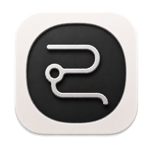

<div align="center">



# Belfry

---

### 托管你的 CLI Agent，也是一把称手的终端。

在 macOS 和 Windows 上用同一套界面跑 Codex、Claude Code，顺带看清它们在忙什么、在等谁。Agent 不在，它照样是完整终端。

[English](README.en.md) · **简体中文**

[](https://github.com/ChengSoon/belfry-desktop)
[](https://github.com/ChengSoon/belfry-desktop/releases)
[](LICENSE)
[](#下载)
[](https://tauri.app)
[](https://github.com/ChengSoon/belfry-desktop/stargazers)

[下载](#下载) · [快速开始](#快速开始) · [功能](#功能) · [界面](#界面) · [设计取向](#设计取向) · [开发](#开发) · [路线图](#路线图) · [许可证](#许可证)

</div>

> [!WARNING]
> **早期开发中。** 目前跑通的是「打开项目 → 检测 Agent → 启动可切换的 Agent/Shell 标签」这一条垂直切片，离下面路线图描述的完整形态还很远。接口和数据格式都可能不兼容地变。

## 下载

安装包在 [Releases](https://github.com/ChengSoon/belfry-desktop/releases) 页面，四个构建目标：macOS Apple Silicon (`aarch64`)、macOS Intel (`x64`)、Windows、Linux。

macOS 产物使用 ad-hoc 签名但未经过 Apple 公证，Windows 产物未签名：

- macOS 首次打开若被 Gatekeeper 拦截，请在 Finder 中右键应用选择「打开」，或去「系统设置 → 隐私与安全性」里放行。
- Windows 上 SmartScreen 会报「未知发布者」，选「更多信息 → 仍要运行」。

最低系统版本：macOS 14，Windows 10 22H2 (Build 19045) / Windows 11。

## 快速开始

Belfry 不自带 Agent，它托管你机器上已经装好的那些。所以先确认至少有一个能用：

```bash
codex --version
claude --version
```

然后：

1. 启动 Belfry，点顶部的项目选择器，选一个本地目录。
2. 侧栏的新会话菜单里挑 Shell、Codex 或 Claude。检测不到的 Agent 会标灰，鼠标悬停能看到原因。
3. 同一个项目下可以并排开多个会话，标签自己按你输入的第一句话命名。
4. `⌘U` 打开用量面板，看 token 花在哪个模型、哪个项目上。

两个 Agent 都没检测到也无妨——Shell 会话不依赖它们，Belfry 此时就是个普通终端。

## 功能

**项目工作区**

- 打开本地目录作为项目，记住最近打开过的
- 侧栏按项目分组，可折叠，宽度可拖拽（`⌘B` 整体收起）
- 会话自带项目归属，不同会话可以指向不同目录

**Agent 托管**

- 自动检测 Codex 与 Claude Code：可执行文件路径、版本号，不可用时给出原因
- 会话状态区分进程生命周期（创建中/运行/已退出/出错）与当下行为（闲着/正在输出/等你选）
- 标签标题从你的第一句输入里提取，完整原文留在 tooltip

**终端**

- 基于 xterm.js，WebGL renderer——块字符之间没有横缝
- macOS 走 Unix PTY，Windows 走 ConPTY；Shell 依次探测 PowerShell、`%ComSpec%`、`cmd.exe`
- OSC 10/11 颜色查询在 Rust 侧直接应答。这件事绕不过去：Codex 这类 TUI 只给 100 ms 窗口，走一圈 `PTY → IPC → xterm.js → IPC → PTY` 经常超时，而 Windows 上超时的后果不是「没颜色」而是「猜错颜色」——Codex 会退回读 ConPTY 的黑色调色板，把输入框画成黑块
- 密码提示识别，输入不回显

**用量统计**

- 直接读本地 Codex / Claude 会话日志聚合，不发任何网络请求
- 四类 token 归一口径：input（不含缓存命中）、cachedInput、cacheWrite、output
- 按模型、按项目两个维度拆分；时间窗口可选近 7 天 / 近 30 天 / 全部
- 配额窗口与套餐类型（目前只有 Codex 的日志带这些字段，Claude 的不带）

**外观**

- 亮/暗主题切换，主题色同步喂给终端调色板
- 内置 JetBrains Mono 与 HarmonyOS Sans SC

快捷键：`⌘B` 折叠侧栏，`⌘U` 开关用量面板。Windows 上用 `Ctrl`。

<!-- 界面截图待补：需要在两个平台各截一张主工作台（亮/暗）。
     osascript 截不到原生窗口（缺辅助功能权限），得手动截。 -->

## 界面

> 截图待补。

## 设计取向

**不代理模型请求。** Belfry 不内置推理客户端，不保存模型 API Key，不碰你的 token。它只是启动你本地的 CLI Agent，并读它自己写下的日志。

**Agent 不可用时完整退化为普通终端。** Agent 集成是增强，不是前置条件。检测失败不该让你打不开一个 Shell。

**共享 UI 与核心，按能力而非操作系统名称分支。** 平台差异收敛在适配器里，业务代码里不写 `if (windows)`。

**不追求两端逐像素相同。** 菜单、快捷键、窗口行为跟随各自平台的习惯。

明确不做：iOS / Android / Web 版；内置模型推理；云同步、账号体系、团队协作、插件市场、LSP 与调试器；静默提权。

## 技术栈

| 层 | 选型 |
| --- | --- |
| 桌面外壳 | Tauri 2 |
| 后端 | Rust 2024 edition（rustc 1.85+）、portable-pty |
| 前端 | React 19、TypeScript、Vite |
| 终端 | xterm.js 6 + WebGL addon |

## 开发

需要 [Rust 工具链](https://rustup.rs)、Node.js LTS 与 pnpm 10。

```bash
pnpm install

pnpm desktop:dev      # 桌面应用，开发模式
pnpm desktop:build    # 打包
pnpm test             # 前端测试（vitest）
pnpm build            # 类型检查 + 前端构建
```

Rust 侧测试：

```bash
cd src-tauri && cargo test
```

### 目录结构

```
src/                  前端
  workspace/          项目工作区、标签、侧栏
  terminal/           PTY 会话与 xterm 控制
  usage/              token 用量聚合与展示
  panel/              面板宽度与拖拽
  theme/              主题与终端调色板
src-tauri/src/        Rust 后端
  project/            项目目录与最近列表
  agent/              Codex / Claude 检测
  terminal/           PTY 后端、启动 profile、OSC 应答
  usage/              解析 Codex / Claude 会话日志
.codestable/          需求、路线图、架构决策与 feature 设计
```

`.codestable/` 是这个项目的文档基座——需求怎么来的、模块怎么切的、每个 feature 的设计与验收清单都在里面。改代码之前值得先翻一眼。

## 路线图

已交付的垂直切片之后，按 [`.codestable/roadmap/belfry-desktop/`](.codestable/roadmap/belfry-desktop/) 的划分推进：

- **Shared UI** — 分屏、设置、Prompt Composer 与 Queue、Quick Open、文件预览 Pane
- **Shared Core** — 会话持久化与恢复、Agent Adapter 基座、历史与 resume、Recipe 回放、导入导出
- **Terminal Runtime** — 跨平台 Shell Profile（zsh/bash/fish、PowerShell/CMD/WSL/Git Bash）、SSH
- **Platform Services** — 通知、Dock / Taskbar、凭证（Keychain / Credential Manager）、全局快捷键、控制 CLI
- **Content & Git** — 文件浏览、编辑预览、Git 集成
- **Distribution** — 签名、公证、安装包与自动更新

## 贡献

Issue 和 PR 都欢迎。动手之前建议先开个 issue 对一下方向——早期阶段接口变动频繁，避免白做。

提 PR 前请确认 `pnpm test`、`pnpm build` 与 `cargo test` 都是绿的。

## 免责声明

Belfry 是终端与会话的托管层，不对 Agent 在你机器上执行的命令负责。Agent 的权限就是你 Shell 的权限：给它读写文件、跑构建、装依赖的能力，它就有能力删掉不该删的东西。请在有版本控制的目录里用它，重要操作自己过一眼。

用量面板的数字来自 Agent 自己写的本地日志，只能当参考，不是账单。请以服务商控制台为准。

## 许可证

[LGPL-3.0](LICENSE)。LGPL-3.0 是 GPL-3.0 的附加条款，完整条件需同时参照 [GPL-3.0](LICENSE.GPL-3.0)。

内置字体各自遵循自己的许可：[JetBrains Mono](public/fonts/LICENSE-JetBrains-Mono.txt)（SIL OFL 1.1）、[HarmonyOS Sans](public/fonts/LICENSE-HarmonyOS-Sans.txt)。

## 友情链接

- [LINUX DO](https://linux.do/) — 开发者社区

