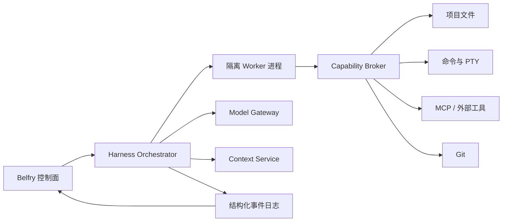

# Belfry AI Harness 插件产品定义

状态更新（2026-09-09）：用户已取消 Harness 功能。本文件保留作历史设计，停止实施；
当前任务见 [PI 插件单一方向：P0 收尾任务](./pi-only-p0-delivery.md)。

日期：2026-09-06。状态：新方向设计基线。旧 Prompt/Recipe 插件方案停止。

## 1. 产品定义

Harness 插件是一套可安装的 AI 编程运行环境。它不只是提供提示词，而是决定一次编程会话如何工作：

- 使用哪些模型和 Provider，如何回退、分流与控制预算；
- Agent 的角色、指令、状态机、子任务与协作方式；
- 可以调用哪些工具，工具参数如何校验，哪些操作需要用户批准；
- 如何收集、排序、裁剪、缓存和压缩项目上下文；
- 如何规划、执行、验证、重试和恢复任务；
- 如何把结构化进度、工具调用、补丁、测试和错误展示给用户。

Belfry 是宿主和控制面：安装、信任、权限、会话、终端、审计、资源限制与界面。
Harness 是会话运行面：模型循环、上下文循环、工具循环、Agent 编排和结果协议。

## 2. 核心用户体验

用户安装一个 Harness 后，可用它创建新的 AI 编程会话。例如：

1. 在“新建会话”中选择 `DeepSeek Coding Harness`。
2. 选择模型、Provider、执行模式和项目权限。
3. Harness 扫描项目规则与代码索引，生成结构化上下文。
4. 用户输入任务；Harness 规划、调用搜索/编辑/终端工具并展示每一步。
5. 高风险动作进入 Belfry 审批中心，批准后继续。
6. Harness 运行测试，汇总修改、证据、成本和未解决问题。
7. 会话可暂停、恢复、导出或切换同一 Harness 的配置预设。

用户必须始终知道：当前运行哪个 Harness/版本、使用哪个模型、已授予哪些能力、
正在调用什么工具、改了哪些文件、消耗多少预算、为什么暂停以及如何恢复。

## 3. 扩展能力模型

### 3.1 Harness Manifest

Manifest 描述身份、入口、API 版本、兼容范围、所需能力、默认配置、界面贡献和运行时要求。
安装预览必须展示所有能力请求。插件不能用未声明能力，也不能自行扩大授权范围。

### 3.2 模型与路由

支持声明模型槽位，而不是把模型名写死在业务流程中：`planner`、`coder`、`reviewer`、`vision`、
`embedding`。用户把槽位映射到现有 Belfry Provider 或 Harness 自带适配器。

路由策略包括：固定模型、按任务类型选择、主备回退、并行候选、预算上限、最大上下文、
超时、重试、速率限制和响应格式。API Key 由 Belfry 凭证代理提供，插件不直接读取明文。

### 3.3 Agent 定义

一个 Harness 可声明多个 Agent：角色、目标、系统指令、允许工具、模型槽位、最大轮次、
上下文策略、完成条件和输出 schema。支持单 Agent、主从 Agent 和有限 DAG 工作流。

首期避免开放无限自治群体。并发数、递归深度、子任务数和总预算由宿主设硬上限。

### 3.4 工具系统

内置宿主工具分组：

- 项目读取：目录、文件、搜索、符号/语义上下文；
- 项目写入：补丁、创建、移动和受控删除；
- 命令执行：PTY 或无交互进程、超时、输出截断和取消；
- Git：状态、差异、历史；写操作作为单独高风险能力；
- 浏览器、MCP、诊断和测试结果；
- 用户交互：提问、选择、审批和通知。

插件可贡献自定义工具，但只能通过 Harness Worker SDK 注册。所有调用进入宿主 capability broker；
Worker 不直接获得主应用 IPC、任意文件系统、系统环境变量或凭证。

### 3.5 上下文系统

Context Provider 可贡献项目规则、Git diff、打开文件、代码搜索、符号关系、终端输出、
会话摘要和用户固定资料。每条上下文包含来源、时间、token 估算、优先级和敏感级别。

Context Policy 决定选择、去重、排序、缓存、截断和压缩。用户可查看“本轮发送了什么”，
并能关闭某类来源。压缩后的摘要必须保留来源引用，不能变成不可追溯的隐藏记忆。

### 3.6 工作流与钩子

支持结构化节点：prompt、agent、tool、condition、approval、parallel、join、retry、verify、finish。
钩子包括 sessionStart、beforeModel、afterModel、beforeTool、afterTool、beforeFinish、onError。

钩子不能绕过权限；钩子失败按 manifest 策略 fail-open 或 fail-closed，默认 fail-closed。
工作流必须有最大步数、超时、取消传播和可恢复检查点。

### 3.7 界面贡献

首期提供宿主控制的 UI schema：配置表单、状态卡、时间线事件、结果报告和只读 Markdown。
插件提交数据模型，Belfry 渲染组件。后续可允许沙箱 WebView 面板，但需独立 CSP、消息白名单、
资源限制和无宿主 DOM 访问；不能把第三方 React 直接挂进主窗口。

## 4. 运行架构



Harness Worker 必须是主应用之外的独立进程。首期推荐 JSON-RPC over stdio，消息带 schemaVersion、
requestId、sessionId 和 sequence。宿主启动、监控并终止 Worker；Worker 崩溃不能带崩 Belfry。

每个会话固定 Harness ID、版本和配置快照。插件更新不改变运行中的会话；新会话使用新版本。
恢复时先检查相同 Harness 版本和兼容协议；缺版本时进入只读历史，不偷偷换新版继续执行。

## 5. 权限模型

能力按作用域授权：只读项目、写当前项目、执行命令、网络域名、MCP server、Git 写操作、
系统目录、凭证引用、通知和剪贴板。授权可设为本次调用、本次会话、当前项目或插件版本。

路径授权必须使用规范化路径和项目根约束；命令以 executable + argv 结构传输，不接收拼接 shell 字符串。
网络默认关闭，开启时使用域名/端口白名单。环境变量默认空白名单，仅传宿主明确批准的键。

审批策略由用户控制，Harness 只能提出建议。删除、覆盖大量文件、Git 历史、远程写入、
安装依赖、修改根配置/CI/数据库与访问项目外路径默认需要审批。

## 6. 会话事件协议

运行过程输出结构化事件：session.started、turn.started、context.selected、model.requested、
model.completed、plan.updated、tool.requested、approval.required、tool.started、tool.output、
tool.completed、patch.proposed、test.completed、checkpoint.saved、usage.updated、session.completed、
session.failed、session.cancelled。

事件必须有单调 sequence、时间、来源 Agent、关联 request/tool ID 和可选用户可见摘要。
工具输出与模型内容分开存储；敏感字段在持久化前由宿主脱敏。完成状态来自结构化事件，
不再依赖终端屏幕文本猜测。

## 7. 安装包与 SDK

建议包格式：目录或 `.belfry-harness` 归档，包含：

```text
manifest.json
worker/<platform executable or portable runtime entry>
schemas/config.schema.json
ui/status.schema.json
README.md
LICENSE
assets/
```

开发模式支持从本地目录加载、热重启 Worker、事件检查器、模拟工具和协议验证。
发布包必须有内容摘要；正式市场阶段再加入开发者签名、撤回与可信更新链。

SDK 首选语言中立协议，官方先提供 TypeScript SDK；Rust/Python 可按同一 JSON-RPC 协议实现。
SDK 包含生命周期、模型请求、工具声明、上下文提供器、事件、取消、检查点和测试 Harness。

## 8. 配置层级

最终配置按以下优先级合并：Harness 默认值 < 用户全局预设 < 项目配置 < 会话临时配置。
每一层只允许 schema 声明的字段，合并结果在启动前预览。项目配置可进入版本控制，
凭证只保存引用 ID。插件升级带配置迁移时必须可预览、可失败回退，不能执行任意迁移脚本。

## 9. MVP 分期

### H0 协议与开发工具

定义 manifest、Worker RPC、事件、工具、权限、取消与错误协议；提供假 Worker 和契约测试器。

### H1 外部 Harness 会话

安装一个受信本地 Harness；创建独立会话；Worker 通过 Model Gateway 调用单模型；
使用项目读取、补丁和受控命令工具；结构化时间线、取消、预算和会话日志完整可用。

### H2 可配置 Agent 与上下文

支持多模型槽位、Agent 定义、Context Provider/Policy、检查点和会话恢复。

### H3 工作流与自定义工具

支持有限 DAG、审批节点、受控自定义工具、MCP 映射和配置预设。

### H4 生态与高级界面

沙箱面板、包签名、市场、自动更新、发布工具和更广泛 SDK。

## 10. MVP H1 验收底线

- Harness Worker 崩溃、卡死或输出非法消息时，Belfry 主应用和普通终端继续工作。
- 插件不能调用未声明或未授权能力；权限撤销后下一次调用立即失败。
- 模型凭证不进入 Worker 环境、日志和 RPC；模型请求可取消并记录实际用量。
- 文件写入通过补丁预览；路径逃逸、符号链接越界和竞态有测试。
- 命令有 cwd、argv、环境白名单、超时、输出上限、取消和退出码。
- 每次工具调用、审批、补丁、测试和模型请求都有可追溯事件。
- 会话固定插件版本；更新、卸载不破坏已保存历史，不能继续运行缺失版本。
- 取消会传播到模型、Worker 和正在执行的工具；超时后无孤儿进程。
- 同一项目并发写操作串行或检测版本冲突，不能静默覆盖。
- macOS 与 Windows 完成安装、启动、编辑、测试、取消、崩溃恢复的真实冒烟。

## 11. 与现有代码的关系

可复用：Tauri/PTY 生命周期、项目文件访问基础、Provider 配置、会话工作区、通知、用量、
历史视图、协作 UI 经验和原子存储帮助函数。

需要新建：Harness Registry、Worker Supervisor、RPC Transport、Model Gateway、Capability Broker、
Context Service、Event Store、Approval Center、Harness Session Adapter 和 SDK/协议 crate。

不能直接复用为核心：旧插件 template/catalog/runCoordinator、Prompt Queue、Recipe 运行状态。
它们的“发送到现有 CLI”模型无法提供结构化工具调用、权限撤销、模型路由和可靠完成状态。

现有 AgentKind 只有 Codex/Claude。Harness 应先作为新的会话类别和动态 profile registry，
不要把每个 Harness ID硬编码进 AgentKind enum。历史、用量和协作通过通用 Session Provider 接口接入。

## 12. 旧原型处理

当前 `src/plugins` 与 `src-tauri/src/plugins` 的模板插件代码保留为未完成原型，停止接线和扩展。
在新 Harness 实现开始前，由开发提交隔离方案：移动到 experimental、改名 legacy，或从构建入口断开。
删除现有文件仍需单独确认；在确认前不得回滚用户其他未提交修改。

旧设计中可复用的只有安装身份、版本固定、原始包校验、原子存储、单 owner 研究、失败恢复和审计思想；
旧 manifest、AC-01..40、Prompt/Recipe 入口及模板 UI 不再定义产品完成标准。
